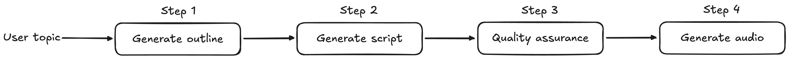

# Mastra audio generation

This repository contains a simple [Mastra](https://mastra.ai/) workflow for generating audio based on a user input using [ElevenLabs](https://elevenlabs.io/).

## How to use

This repository uses Bun as the package manager and runtime.

1. Clone the repository
2. Make sure you have Bun installed
3. Run `bun install` to install the dependencies
4. Run `bun run src/index.ts` to generate the audio.

### Environment variables

You need to create an `.env` file in the root of the project with the following variables:

```env
OPENAI_API_KEY=your_openai_api_key
ELEVENLABS_API_KEY=your_elevenlabs_api_key
```

## How it works

1. The workflow starts with a user input.
2. It generates an outline for the topic.
3. It generates a script.
4. It runs the script through an "editor" agent.
5. It generates an audio file from the script using ElevenLabs.
6. It saves the audio file.


